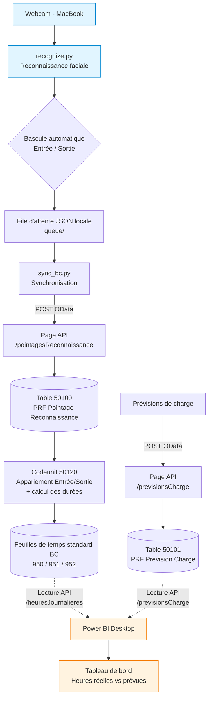

# Système de pointage par reconnaissance faciale connecté à Business Central

**Récapitulatif technique du projet d'intégration**

> Ce document est une synthèse technique de l'état du projet. Il sert de base de travail pour la rédaction du rapport final : chaque section correspond approximativement à un chapitre de rapport (présentation, architecture, réalisation, conformité, tests, limites et perspectives). Il ne remplace pas le rapport, il en regroupe la matière.

---

## 1. Présentation du projet

Le projet met en œuvre un système de **pointage des collaborateurs par reconnaissance faciale**, intégré au système de gestion d'entreprise **Microsoft Dynamics 365 Business Central** (édition on-premise).

Un collaborateur se présente devant une caméra ; le système l'identifie, enregistre un pointage (entrée ou sortie), puis transforme automatiquement ces pointages en **feuilles de temps** dans Business Central. Les données consolidées sont ensuite analysées dans un **tableau de bord Power BI** comparant les heures réellement effectuées aux heures prévues.

L'objectif fonctionnel est de supprimer la saisie manuelle des temps de présence tout en alimentant directement le module de gestion des temps de l'ERP, et de fournir un outil de pilotage (présence réelle vs prévision de charge).

---

## 2. Architecture générale

Le système s'articule en trois couches : **acquisition** (poste de reconnaissance), **traitement et stockage** (Business Central), **restitution** (Power BI). La communication entre la couche d'acquisition et Business Central s'effectue exclusivement par des **API web (OData/REST)**.

**Point clé de l'architecture :** l'image et les données biométriques **ne quittent jamais le poste d'acquisition**. La reconnaissance produit uniquement un **code ressource** (l'identité du collaborateur), qui est la seule donnée transmise à Business Central. Ce choix est central pour la conformité (voir section 8).

---

## 3. Choix de conception

| Décision | Description | Justification |
|---|---|---|
| Aucune donnée biométrique dans l'ERP | Seul un code ressource est transmis ; aucune image ni vecteur facial n'entre dans BC | Minimisation des données (nLPD / RGPD) ; réduction de la surface de risque |
| Pages de type `API` | Les données custom sont exposées via des pages `PageType = API` sur un endpoint dédié `/api/prf/pointage/v1.0/` | Exposition automatique à l'installation, pas d'inscription manuelle en web service, format REST standard |
| Bascule Entrée/Sortie côté client | Le client Python détermine automatiquement si un passage est une entrée ou une sortie en fonction du dernier pointage du jour | Permet un usage naturel : 1er passage = arrivée, 2e passage = départ |
| Anti-rebond (cooldown) | Un même collaborateur ne peut pas générer deux pointages à moins de 30 secondes d'intervalle | Évite les pointages multiples si la personne reste devant la caméra |
| File d'attente locale | Les pointages sont d'abord écrits en JSON local, puis synchronisés vers BC | Tolérance aux coupures réseau ; le pointage n'est pas perdu si BC est indisponible |
| Réutilisation des feuilles de temps standard | Les pointages alimentent les tables standard BC 950/951/952 plutôt qu'une structure propriétaire | Intégration native au module de gestion des temps de l'ERP, compatibilité avec les workflows d'approbation existants |

---

## 4. Composants développés

### 4.1 Extension Business Central (code AL)

L'extension `PRF Pointage Reconnaissance` (éditeur `PRF`, version 1.0.0.1) regroupe l'ensemble des objets custom.

**Tables**

| ID | Nom | Rôle | Champs principaux |
|---|---|---|---|
| 50100 | PRF Pointage Reconnaissance | Stocke les pointages bruts reçus du poste de reconnaissance | Code collaborateur/ressource, Date-Heure, Type (Entrée/Sortie), Score de concordance, Statut (Validé/À vérifier), Traité, N° feuille de temps, Date traitement |
| 50101 | PRF Prevision Charge | Stocke les prévisions de charge (heures planifiées) | Code collaborateur, Date, Heures prévues, Poste |

**Pages API**

| ID | Nom | EntitySet | Table source |
|---|---|---|---|
| 50110 | PRF Pointage Rec. API | `pointagesReconnaissance` | 50100 (pointages) |
| 50111 | PRF Saisie Heures API | `jobs` | Job (projets standard BC) |
| 50112 | PRF Prevision Charge API | `previsionsCharge` | 50101 (prévisions) |
| 50113 | PRF Heures Journalières API | `heuresJournalieres` | Time Sheet Detail (952), heures calculées |

Toutes les pages utilisent `ODataKeyFields = SystemId` et sont exposées sur l'endpoint `/api/prf/pointage/v1.0/`.

La page `heuresJournalieres` expose les **heures réellement calculées** par le codeunit d'agrégation (durée journalière par ressource), directement consommable par Power BI pour la comparaison réel vs prévu. Champs exposés : `timeSheetNo`, `resourceNo`, `date`, `quantity` (heures), `status`. Elle évite de recalculer les durées dans l'outil BI : la logique métier d'appariement reste unique, côté Business Central.

**Codeunits**

| ID | Nom | Rôle |
|---|---|---|
| 50120 | PRF Generation Feuilles De Temps | Cœur du traitement : lit les pointages validés et non traités, apparie les entrées/sorties, calcule les durées, génère les feuilles de temps standard, marque les pointages traités. Déclenchable manuellement ou par tâche planifiée (Job Queue). |
| 50121 | PRF Demo Setup | Échafaudage de démonstration : crée la souche de numérotation `PRF-PONT` et configure les utilisateurs propriétaire/approbateur sur les ressources. Conçu pour fonctionner dans plusieurs sociétés (`Access = Internal`). |
| 50122 | PRF Demo Cleanup | Échafaudage de démonstration : supprime les données de démonstration via la couche métier BC. |

**Permission set**

| ID | Nom | Rôle |
|---|---|---|
| 50100 | (permission set de l'extension) | Droits d'accès aux objets custom |

### 4.2 Client de reconnaissance (Python)

Le client `recognition-client` s'exécute sur le poste d'acquisition (macOS).

| Fichier | Rôle |
|---|---|
| `recognize.py` | Boucle principale : capture webcam, détection et reconnaissance des visages, génération des pointages |
| `config.py` | Paramètres de reconnaissance et d'envoi |
| `sync_bc.py` | Synchronisation de la file d'attente locale vers l'API Business Central |
| `queue/` et `queue/sent/` | File d'attente JSON locale (pointages en attente d'envoi / déjà envoyés) |

**Fonctions notables**

- `deduire_type_pointage()` — détermine Entrée ou Sortie par bascule, en fonction du dernier pointage du jour de la personne.
- `dernier_type_du_jour()` — lit l'état du jour dans les fichiers JSON locaux.
- `_reconnect_webcam()` — reconnexion automatique du flux webcam (jusqu'à 5 tentatives) pour pallier les pertes intermittentes sous macOS.
- Mécanisme de **cooldown** (30 s) en mémoire pour l'anti-rebond.

**Paramètres de reconnaissance retenus**

| Paramètre | Valeur | Effet |
|---|---|---|
| `DISTANCE_MAX` | 0.55 | Seuil de distance faciale maximale acceptée (plus strict que la tolérance par défaut, réduit les faux positifs) |
| `SEUIL_CONCORDANCE` | 0.50 | Seuil de score au-delà duquel un pointage est « Validé » ; en deçà, statut « À vérifier » |

---

## 5. Flux de données détaillé

1. **Acquisition** — Le collaborateur se présente devant la webcam. `recognize.py` détecte le visage et le compare aux visages enrôlés.
2. **Identification** — En cas de correspondance, le système obtient le code ressource du collaborateur et un score de concordance.
3. **Détermination du type** — La fonction de bascule consulte le dernier pointage du jour : si c'est une entrée, le nouveau pointage est une sortie, et inversement.
4. **Mise en file** — Le pointage (code, date-heure, type, score, statut) est écrit en JSON dans la file d'attente locale. Si le score est sous le seuil, le statut est « À vérifier ».
5. **Synchronisation** — `sync_bc.py` envoie les pointages en attente vers l'API Business Central (`POST /pointagesReconnaissance`) et les déplace vers `queue/sent/`.
6. **Stockage** — Business Central enregistre chaque pointage dans la table 50100.
7. **Traitement** — Le codeunit 50120 (déclenché manuellement ou par tâche planifiée) lit les pointages validés et non traités, apparie les paires entrée/sortie par collaborateur et par jour, calcule la durée travaillée (gestion correcte du passage à minuit), puis crée ou met à jour les feuilles de temps standard (en-tête 950, ligne 951, détails journaliers 952). Les pointages traités sont marqués comme tels.
8. **Restitution** — Power BI lit, via l'API, les **heures journalières déjà calculées** (entité `heuresJournalieres`, issue des feuilles de temps) et les **prévisions de charge** (entité `previsionsCharge`), puis présente un tableau de bord comparant heures réelles et heures prévues. Les pointages bruts (`pointagesReconnaissance`) restent disponibles pour les indicateurs de qualité (score, statut « À vérifier »).

**Traitement des cas particuliers par le codeunit 50120 :**

- Double entrée consécutive : la première est abandonnée (avertissement).
- Sortie sans entrée préalable : ignorée (avertissement).
- Entrée sans sortie en fin de journée : non comptabilisée (avertissement).
- Pointage au statut « À vérifier » : non traité (exclu de la génération des feuilles de temps).
- Le traitement est idempotent : relancer le codeunit ne crée pas de doublons.

---

## 6. Infrastructure et déploiement

| Élément | Détail |
|---|---|
| Serveur applicatif | Business Central on-premise, instance `BC260`, version 26.2 |
| Base de données | Microsoft SQL Server, instance `BC2025\BCDEMO`, base « Demo Database BC (26-0) » |
| Société de travail | CRONUS (Suisse) SA |
| Poste d'acquisition | MacBook Air (client Python, webcam) |
| Restitution | Power BI Desktop |
| Connexion poste ↔ serveur | Prévue via Tailscale (réseau privé) pour la démonstration en conditions réelles |

**Ports Business Central** (point d'attention : trois ports distincts cohabitent)

| Port | Usage |
|---|---|
| 7048 | OData / API (consommé par Power BI et le client Python) |
| 7049 | Management / développement (déploiement des extensions) |
| 8080 | Client web Business Central |

**Endpoints d'accès aux données**

- API custom : `http://<hôte>:7048/BC260/api/prf/pointage/v1.0/companies(<id-société>)/<entité>`
- Les pages de type `API` n'apparaissent **pas** dans l'endpoint OData standard `/ODataV4/` ni dans la liste des web services : elles sont exposées automatiquement sur leur endpoint `/api/...` dédié.

**Déploiement de l'extension** : compilation AL, puis publication / synchronisation / installation dans l'instance via les commandes d'administration Business Central.

---

## 7. Jeu de données de démonstration

Un jeu de données représentatif a été inséré dans la société CRONUS (Suisse) SA, sur une semaine de travail de janvier 2026, afin d'alimenter le tableau de bord et la démonstration.

| Élément | Contenu |
|---|---|
| Collaborateurs | 3 ressources (ALAIN, ANNETTE, CHRISTIAN) |
| Pointages (table 50100) | ~28 pointages sur la semaine, majoritairement validés |
| Prévisions (table 50101) | 15 lignes (3 collaborateurs × 5 jours), ~8 h prévues par jour |
| Feuilles de temps générées | 1 feuille par collaborateur sur la semaine concernée |

**Anomalies volontaires** (pour rendre le tableau de bord et les contrôles parlants) :

- Une **absence** : un collaborateur sans pointage un jour donné.
- Un pointage à **score faible (0.43)** basculé en statut « À vérifier », donc non traité par le codeunit.
- Un **dépassement horaire** (sortie tardive) générant une durée journalière supérieure à la prévision.

> Remarque importante (contrainte technique) : la licence de la base de démonstration CRONUS limite les champs de type Date aux mois de novembre, décembre, janvier et février. C'est la raison pour laquelle le jeu de données est positionné en janvier 2026 et non sur la période courante. Cette limitation est propre à la base de démonstration et ne concernerait pas une installation de production.

---

## 8. Conformité et protection des données

La conception répond au principe de **proportionnalité et de minimisation des données** (nLPD, RGPD art. 5) :

- **Aucune donnée biométrique n'est transmise ni stockée dans Business Central.** Le gabarit facial et l'image restent sur le poste d'acquisition.
- La seule donnée transmise à l'ERP est le **code ressource** du collaborateur, accompagné de métadonnées de pointage (horodatage, type, score). Le score est un indicateur de fiabilité, pas une donnée biométrique réutilisable.
- En conséquence, la base de données de l'ERP ne contient **aucune information permettant de reconstituer une identité biométrique**, ce qui réduit fortement la sensibilité des données stockées et la surface de risque en cas de fuite.

Cette architecture constitue un argument solide pour l'analyse de risque du projet : le traitement biométrique (sensible) est confiné au poste local, tandis que le système central ne manipule que des identifiants métier.

---

## 9. Limites connues et pistes d'industrialisation

Les éléments suivants sont des limites identifiées dans l'état actuel. Ils ne bloquent pas la démonstration mais doivent être documentés comme axes d'amélioration : leur identification témoigne d'une compréhension mature du système.

**Côté Business Central / traitement**

- **Journalisation des avertissements en exécution planifiée** : les avertissements émis par le codeunit lors d'une exécution par tâche planifiée ne sont pas visibles. Une vraie journalisation (table de log applicatif) serait nécessaire en production.
- **Prérequis de configuration non bloquant** : la création d'une feuille de temps exige que les champs « propriétaire » et « approbateur » soient renseignés sur la fiche ressource. En leur absence, la création échoue silencieusement. Ce prérequis devrait être contrôlé explicitement.
- **Définition du premier jour de semaine** : le calcul force actuellement le lundi (norme ISO) ; il devrait idéalement lire le paramétrage de la configuration des ressources.
- **Périodes comptables clôturées** : un pointage tombant dans une période clôturée provoque une erreur non interceptée. Une gestion dédiée serait nécessaire.
- **Gestion d'erreur par enregistrement** : en cas d'échec sur un enregistrement, le traitement du lot en cours est interrompu. Une isolation par enregistrement améliorerait la robustesse.

**Côté client de reconnaissance**

- **Persistance de l'anti-rebond** : le cooldown de 30 s est conservé en mémoire et perdu au redémarrage du script. Une persistance sur disque garantirait la cohérence après redémarrage.
- **Source de vérité de la bascule** : la détermination entrée/sortie repose sur les fichiers locaux et non sur l'état réel dans Business Central. Une vérification côté serveur fiabiliserait le mécanisme.

**Contraintes d'environnement**

- La restriction de dates de la base de démonstration (section 7) impose de positionner les données sur une fenêtre limitée. Sans objet en production.

---

## 10. Points d'attention pour la démonstration

Liste de contrôle à dérouler avant la soutenance.

- **Réinitialiser l'état du client** : vider la file d'attente locale (`queue/` et `queue/sent/`) pour que le premier passage de chaque collaborateur soit bien interprété comme une entrée.
- **Vérifier les enrôlements** : s'assurer que les collaborateurs de démonstration sont correctement reconnus dans les conditions d'éclairage de la salle (le seuil de 0.55 est sensible à la qualité des captures).
- **Configurer les ressources** : les champs propriétaire et approbateur de feuille de temps doivent être renseignés sur les ressources utilisées (sinon la génération échoue silencieusement).
- **Respecter le cooldown** : prévoir une rotation entre collaborateurs (A → B → C → A…) pour que le délai anti-rebond de 30 s soit écoulé entre deux passages d'une même personne.
- **Déclenchement du traitement** : prévoir un moyen de lancer le codeunit de génération pendant la démonstration (déclenchement manuel recommandé, plus maîtrisé qu'une tâche planifiée).
- **Restitution** : présenter le tableau de bord Power BI pour l'analyse, et ouvrir une feuille de temps dans Business Central pour prouver la génération automatique.

---

## 11. État d'avancement et travaux réalisés

Synthèse des travaux de développement et de mise au point réalisés.

- **Extension AL** : résolution des points en suspens et validation contre les symboles réels de Business Central ; correction du champ clé OData (`SystemId`) ; compilation sans erreur.
- **Page API des prévisions** : création de la page manquante exposant la table des prévisions de charge.
- **Codeunit de génération** : correction d'un défaut d'ordonnancement dans la création des en-têtes de feuille de temps (assignation du numéro avant l'insertion).
- **Client Python** : calibration des seuils de reconnaissance ; ajout de la reconnexion automatique de la webcam sous macOS.
- **Données de démonstration** : mise en place d'un jeu de données représentatif dans la société de travail, avec anomalies volontaires ; déploiement des codeunits d'échafaudage (setup et nettoyage).
- **Diagnostic d'intégration** : identification de l'endpoint et du port OData corrects, et de l'architecture des endpoints API custom.

---

*Document de travail — à compléter et reformuler pour le rapport final.*
